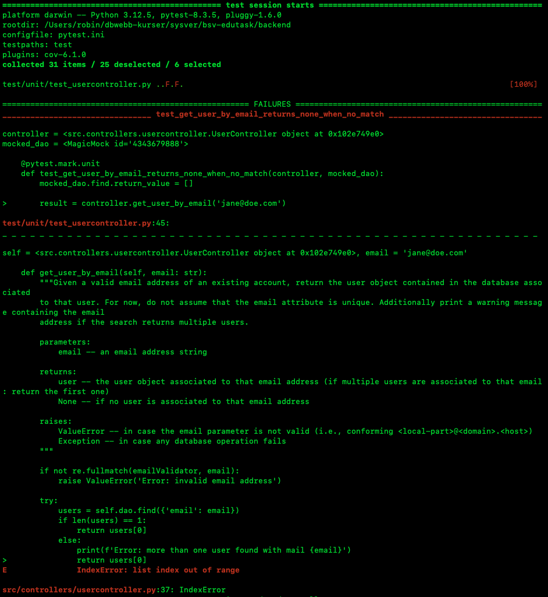
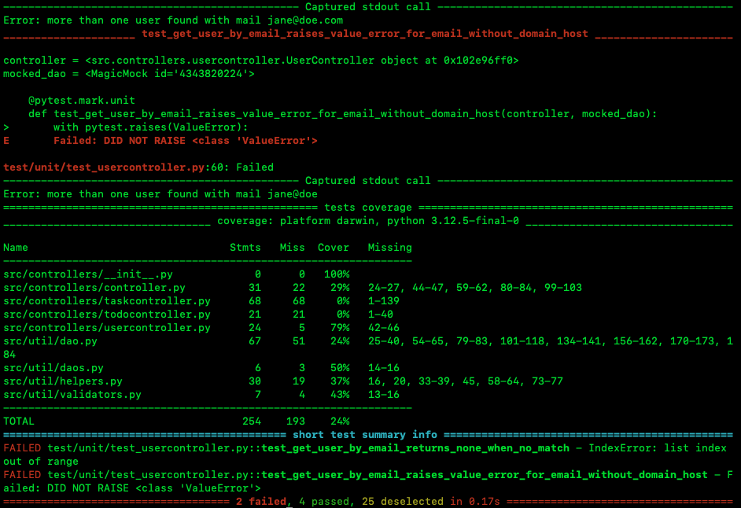

# Assignment 2

Team Members:  
Robin Sanssi (rosa24)  
Mirnes Mrso (mimr24)

Group Number:  
35

Repository Link:  
https://github.com/mirNNes/bsv-edutask

## Work distribution

The work was divided between us both. Mirnes prepared the initial drafts for parts of the assignment, and Robin reviewed and improved different parts. All parts were discussed and checked by us both.

## 1. Mocking

### Explanation of mocking

Mocking is a testing technique in which real dependencies of a system are replaced with controlled, simulated objects. Instead of interacting with actual components such as databases or external services, a mock object is used to imitate their behavior. The tester can define in advance what the mock should return or how it should behave under certain conditions.

### Purpose of mocking in unit testing

The main purpose of mocking in unit testing is to isolate the unit under test from its dependencies. By replacing external components with mocks, the test focuses only on the behavior of the specific method being tested. This ensures that the test results are not influenced by unrelated parts of the system.

Additionally, mocking allows the tester to simulate different scenarios, including edge cases and error conditions, which might be difficult or impossible to reproduce using real components. It also improves test reliability and repeatability, since the behavior of the mock is fully controlled and deterministic.

## 2. Unit Testing

### Test Case Design

The test cases for the get_user_by_email method were derived based on the method's specification provided in the docstring. The docstring was used as the test oracle, defining the expected behavior of the method for different inputs.

We used the 4-step test design technique to create the test cases in a structured way.

#### Step 1: Identify action and expected outcomes

The action is:

- Call get_user_by_email(email).

The possible expected outcomes are:

- The matching user object is returned.
- The first matching user object is returned and a warning message is printed.
- None is returned.
- ValueError is raised.
- A database exception is propagated.

#### Step 2: Identify conditions

The outcome depends on whether the email input is valid and on what the DAO returns when it searches for the email.

| Condition | Possible values |
| --- | --- |
| Email validity | valid email / invalid email |
| DAO lookup result | one matching user / multiple matching users / no matching users / database failure |

The docstring says that a valid email should follow the format `<local-part>@<domain>.<host>`. Because of this, `jane@doe.com` is used as a valid email, while both `invalid-email` and `jane@doe` are invalid.

#### Step 3: Determine combinations

The relevant combinations are listed below. When the email is invalid, the DAO result does not matter, because the method should raise ValueError before calling the DAO.

| # | Email validity | DAO lookup result | Relevant? |
| --- | --- | --- | --- |
| 1 | valid email | one matching user | yes |
| 2 | valid email | multiple matching users | yes |
| 3 | valid email | no matching users | yes |
| 4 | valid email | database failure | yes |
| 5 | invalid email | any DAO result | collapsed, because the DAO should not be called |

#### Step 4: Define expected outcomes

From these combinations, we derived the following test cases:

| Test case | Email input | Mocked DAO behavior | Expected outcome |
| --- | --- | --- | --- |
| TC1 | `jane@doe.com` | returns `[user]` | the user object is returned |
| TC2 | `jane@doe.com` | returns `[user1, user2]` | the first user object is returned and a warning message is printed |
| TC3 | `jane@doe.com` | returns `[]` | None is returned |
| TC4 | `invalid-email` | DAO is not called | ValueError is raised |
| TC5 | `jane@doe` | DAO is not called | ValueError is raised |
| TC6 | `jane@doe.com` | raises Exception | the exception is propagated |

### Test Implementation

The test cases were implemented using the Pytest framework. The structure of the tests follows the Arrange-Act-Assert (AAA) pattern, where inputs are prepared, the method is executed, and the result is verified.

Mocking was applied using unittest.mock.MagicMock to simulate the DAO dependency. This allowed full control over the return values of the find() method without relying on a real database. This is important because the database is outside the scope of this unit test.

Fixtures were used to create reusable test setup for the mocked DAO and the UserController instance. Additionally, the capsys fixture was used to capture printed output when testing the behavior for multiple matching users.

The invalid email test cases also check that the DAO is not called. This is done because invalid input should be rejected before the method tries to search in the database.

The implementation of the tests can be found in the file:

https://github.com/mirNNes/bsv-edutask/blob/master/backend/test/unit/test_usercontroller.py

### Test Execution Result

The tests were executed with the following command:

```text
.venv/bin/python -m pytest -m unit
```





The test execution showed that four out of six test cases passed successfully. Two test cases failed.

The first failed test case was the scenario where no user is found. According to the oracle, the method should return None. Instead, the method tried to return the first item from an empty list, which caused an IndexError.

The second failed test case was the scenario with the email `jane@doe`. According to the oracle, this email is invalid because it does not follow the format `<local-part>@<domain>.<host>`. The method did not raise ValueError for this input.

### Coverage Interpretation

The coverage report shows that approximately 79% of the usercontroller.py file is covered by the implemented tests. This indicates that the main execution paths of the get_user_by_email method are exercised, including normal operation, invalid input handling, and exception scenarios.

The overall project coverage is lower, as only a specific part of the system was tested in this assignment. This is expected, since the focus was on a single method rather than the entire application.
