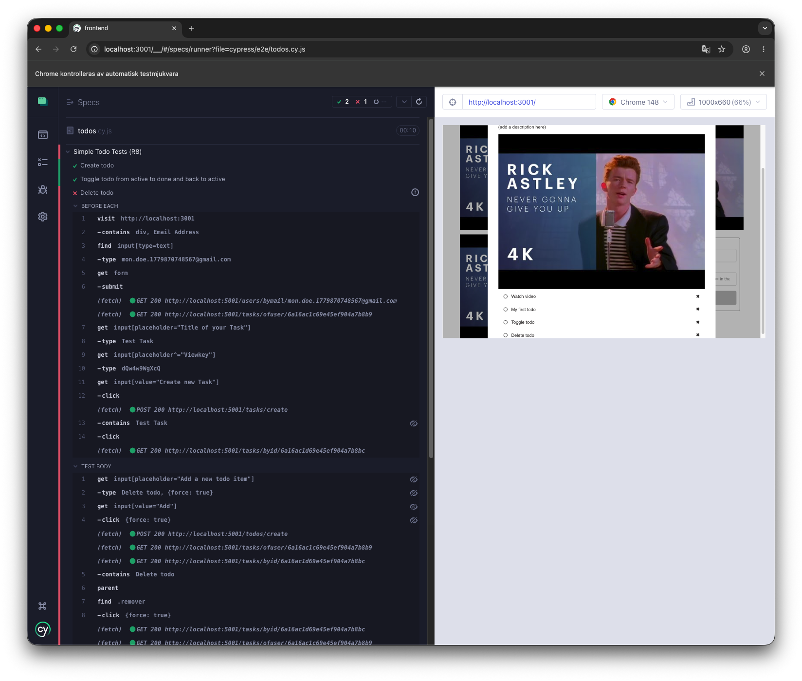
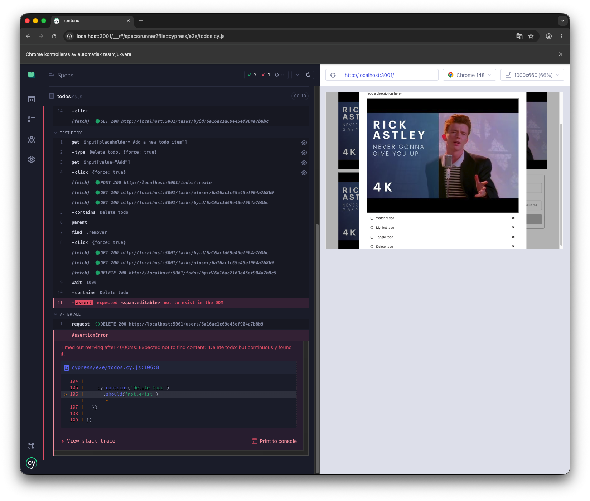

# Assignment 4: GUI Testing

Team Members:

Robin Sanssi (rosa24)  
Mirnes Mrso (mimr24)

Group Number:35

Repository Link:

https://github.com/mirNNes/bsv-edutask

```{=typst}
#pagebreak()
```

## 1. Graphical User Interface Tests

### Test design

We applied the test design technique separately for each use case.

### R8UC1 - Create to-do item

#### Step 1: Identify action and conditions

The action tested is:

- Create a to-do item

The conditions that affect the outcome are:

| **Condition**                     | **Possible values**               |
|:----------------------------------|:----------------------------------|
| User is in task detail view       | yes / no                          |
| To-do description                 | valid / empty                     |
| Add button is clicked             | yes / no                          |

#### Step 2: Construct combinations

| **ID**  | **Task detail view** | **Description** | **Add clicked** | **Expected outcome**              |
|:--------|:---------------------|:----------------|:----------------|:----------------------------------|
| 1       | yes                  | valid           | yes             | to-do item is created             |
| 2       | yes                  | empty           | no              | to-do item is not created         |

#### Step 3: Denote expected outcome

- If the user enters a valid description and clicks Add, the new active to-do item should
appear at the bottom of the list.

- If the description is empty, the Add button should remain disabled and no to-do item
should be created.

#### Step 4: Collapse to relevant test cases

The empty-description alternative scenario is identified in the test design, but it is not selected
as a final Cypress test case in this submission because the implemented GUI tests focus on the
three required user actions: create, toggle, and delete to-do items.

| **Test case**                         | **Expected result**                              |
|:--------------------------------------|:-------------------------------------------------|
| Create to-do item with valid text     | The item should appear in the list               |

### R8UC2 - Toggle to-do item

#### Step 1: Identify action and conditions

The action tested is:

- Toggle an existing to-do item

The conditions that affect the outcome are:

| **Condition**                     | **Possible values**               |
|:----------------------------------|:----------------------------------|
| User is in task detail view       | yes / no                          |
| To-do item exists                 | yes / no                          |
| To-do item status before click    | active / done                     |

#### Step 2: Construct combinations

| **ID**  | **Task detail view** | **Item exists** | **Status before click** | **Expected outcome**              |
|:--------|:---------------------|:----------------|:------------------------|:----------------------------------|
| 1       | yes                  | yes             | active                  | item changes to done              |
| 2       | yes                  | yes             | done                    | item changes to active            |

#### Step 3: Denote expected outcome

- If the to-do item is active and the user clicks the icon, it should become done and be
shown as completed.

- If the to-do item is done and the user clicks the icon, it should become active again.

#### Step 4: Collapse to relevant test cases

| **Test case**                         | **Expected result**                              |
|:--------------------------------------|:-------------------------------------------------|
| Toggle an active to-do item           | The item should change from active to done       |
| Toggle a done to-do item              | The item should change from done to active       |

### R8UC3 - Delete to-do item

#### Step 1: Identify action and conditions

The action tested is:

- Delete an existing to-do item

The conditions that affect the outcome are:

| **Condition**                     | **Possible values**               |
|:----------------------------------|:----------------------------------|
| User is in task detail view       | yes / no                          |
| To-do item exists                 | yes / no                          |
| Delete button is clicked          | yes / no                          |

#### Step 2: Construct combinations

| **ID**  | **Task detail view** | **Item exists** | **Delete clicked** | **Expected outcome**              |
|:--------|:---------------------|:----------------|:-------------------|:----------------------------------|
| 1       | yes                  | yes             | yes                | item is removed from the list     |

```{=typst}
#pagebreak()
```

#### Step 3: Denote expected outcome

- If the user clicks the delete button for an existing to-do item, the item should be removed
from the to-do list.

#### Step 4: Collapse to relevant test cases

| **Test case**                         | **Expected result**                              |
|:--------------------------------------|:-------------------------------------------------|
| Delete an existing to-do item         | The item should be removed from the list         |

### Cypress test implementation

The Cypress tests were implemented in:

`https://github.com/mirNNes/bsv-edutask/blob/master/frontend/cypress/e2e/todos.cy.js`

The test suite creates a test user before the tests and removes this user after the tests.
This also removes the tasks and to-do items created during the test run.

The toggle test verifies both directions of the use case: active to done and done back to active.

### Test execution results:

- R8UC1 (Create to-do item): Passed
- R8UC2 (Toggle to-do item): Passed
- R8UC3 (Delete to-do item): Failed

The screenshots below show the Cypress execution result and the failure details for R8UC3.





### Failure description

The delete functionality does not work correctly. After clicking the remove button, the todo
item remains visible in the GUI. The Cypress log shows that a DELETE request is sent to the
backend and receives a successful response, but the GUI still does not remove the item from
the visible to-do list after the deletion action.

```{=typst}
#pagebreak()
```

## 2. Declarative vs. imperative UI Testing

### 1. Explanation

Declarative UI testing means describing what the expected behavior or outcome of the
system is, without specifying every step in detail. The focus is on the result. For example, a
test might express that a todo item should exist after being created, without explicitly
describing every UI interaction step.

Imperative UI testing means describing exactly how the test should be executed step by
step. It includes all actions the user performs, such as clicking buttons, typing into fields, and
navigating through the interface.

### 2. Discussion

For UI testing, a combination of both approaches is often most useful. However, declarative
testing is generally more suitable at a higher level because it makes tests easier to read,
understand, and maintain.

Declarative tests focus on expected behavior and align well with user requirements. This
makes them more stable when the UI changes. Imperative tests are necessary to interact
with the GUI, but they can become fragile if the interface changes.

In practice, a good approach is to write test cases in a declarative way while implementing
the interactions imperatively. This balances readability and control, especially when using
tools like Cypress.
